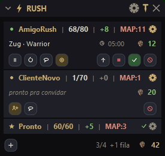

# RUSH Overlay

Overlay in-game para **rush de leveling no Path of Exile 2** — registra os
compradores automaticamente e organiza os atendimentos enquanto você joga.
· In-game overlay for **leveling rush services in Path of Exile 2** — it
auto-registers buyers and organizes your queue while you play.

  
  
  
  

  

  

<b><a href="#português">🇧🇷 Português</a> · <a href="#english">🇺🇸 English</a></b>

---

## Português

Um **único instalador**, com **seleção de idioma (Português / Inglês)** no
assistente. Você também troca o idioma a qualquer momento na aba **CONFIG**.

### Download e instalação

Baixe o `RushOverlay-Setup-x.y.z.exe` na página de
**[Releases](https://github.com/falvstech/rush-overlay-dist/releases/latest)**,
execute e siga o assistente (escolha o idioma no início). **Não precisa de nada
instalado** — o app é standalone. Cria atalho na Área de Trabalho e no Menu
Iniciar.

> **Requisito:** PoE 2 em modo **Janela** ou **Janela sem borda** (fullscreen
> exclusivo cobre o overlay).

### O que faz

- Whisper de `leveling carry / rush (X to Y)` → registra **nome + faixa de level
  + preço** pela tabela. Aceita variações (`1 to 70`, `1-70`, `1 a 70`) e cliente
  EN (`@From`) / BR (`@De`).
- Até **4 clientes simultâneos** + fila de espera.
- **Aceitar** envia `/invite Nome` no chat do jogo.
- Cards **compactos de uma linha** (`nome  cur/hi  +ganho  MAP  ✓ ✕`); clique
  para expandir timer, pagamento, gear, prorrogar e ações.
- **Prorrogar** com `+1 / +5 / +10` e **tabela de preço por cliente**.
- **Adicionar cliente manualmente** (nome + faixa de level).
- **Mensagens:** menu 💬 com mensagens manuais, e gatilhos automáticos
  (ao aceitar / ao emprestar gear / ao concluir) — enviadas como sussurro.
- **Só com o PoE aberto:** aparece com o jogo e some quando ele minimiza/fecha.
- **Opacidade** do painel ajustável.

### Abas

- **SERVICES** — clientes ativos + estatísticas (hoje / 7 dias / total).
- **MSGS** — mensagens-modelo e seus gatilhos.
- **PREÇOS** — tabelas editáveis faixa → div (até 3, uma ativa).
- **CONFIG** — idioma, atalho, opacidade, "só com PoE aberto" e caminho do log.

### Problemas comuns

- **Atalho não funciona com o jogo em foco** → rode como Administrador (jogo
  elevado bloqueia hooks de apps não elevados).
- **"log não encontrado"** → em CONFIG, aponte o `Client.txt`
  (`.../Path of Exile 2/logs/Client.txt`).

---

## English

A **single installer** with **language selection (Portuguese / English)** in the
wizard. You can also switch language anytime in the **CONFIG** tab.

### Download & install

Grab `RushOverlay-Setup-x.y.z.exe` from the
**[Releases](https://github.com/falvstech/rush-overlay-dist/releases/latest)**
page, run it and follow the wizard (pick the language at the start). **Nothing
else to install** — the app is standalone. It adds Desktop and Start Menu
shortcuts.

> **Requirement:** PoE 2 in **Windowed** or **Borderless Fullscreen** (exclusive
> fullscreen covers the overlay).

### What it does

- `leveling carry / rush (X to Y)` whisper → registers **name + level range +
  price** from the table. Handles variations (`1 to 70`, `1-70`) and EN (`@From`)
  / PT (`@De`) clients.
- Up to **4 simultaneous clients** + a waiting queue.
- **Accept** sends `/invite Name` to the game chat.
- **Compact one-line cards** (`name  cur/hi  +gained  MAP  ✓ ✕`); click to expand
  timer, payment, gear, extend and actions.
- **Extend** with `+1 / +5 / +10` and a **per-client price table**.
- **Add a client manually** (name + level range).
- **Messages:** a 💬 menu with manual messages, plus auto-triggers (on accept /
  on lending gear / on complete) — sent as a whisper.
- **Only when PoE is open:** shows with the game and hides when it minimizes/closes.
- Adjustable panel **opacity**.

### Tabs

- **SERVICES** — active clients + stats (today / 7 days / total).
- **MSGS** — message templates and their triggers.
- **PRICES** — editable range → div tables (up to 3, one active).
- **CONFIG** — language, hotkey, opacity, "only when PoE is open" and log path.

### Troubleshooting

- **Hotkey doesn't work while the game is focused** → run as Administrator (an
  elevated game blocks hooks from non-elevated apps).
- **"log not found"** → in CONFIG, point to `Client.txt`
  (`.../Path of Exile 2/logs/Client.txt`).

---

## Changelog

- **2.0.10** — **Correção importante: o app confundia o navegador com o jogo.** Se você
  tivesse o **PoE2 Trade aberto no Chrome**, o app podia achar que a aba era o jogo (o
  título dela é "PoE2 Trade - Path of Exile - ..."). Quando isso acontecia, ao enviar uma
  mensagem ele **trazia o navegador pra frente no meio do rush e colava a mensagem lá
  dentro** — e o overlay não aparecia. Como o erro dependia da ordem dos programas
  abertos, ele ia e voltava sozinho. Agora o app identifica o jogo pelo **programa**, não
  pelo título da janela. **Recomendada pra todo mundo**, principalmente quem usa o Trade.
  · **Important fix: the app could mistake your browser for the game.** With **PoE2 Trade
  open in Chrome**, the app could treat that tab as the game (its title reads "PoE2 Trade
  - Path of Exile - ..."). When it did, sending a message would **bring the browser to
  the front mid-rush and paste the message into it** — and the overlay wouldn't show.
  Since it depended on the order of running programs, it came and went on its own. The
  app now identifies the game by the **program itself**, not the window title.
  **Recommended for everyone**, especially Trade users.
- **2.0.9** — **Envio de chat ~10x mais rápido**: o app não sobe mais um PowerShell
  novo (que recompilava tudo do zero, ~3s) a cada mensagem — agora é um processo só,
  reaproveitado, e cada envio leva ~0.3s. Aceitar um cliente com `/invite` +
  mensagem automática deixou de **travar o jogo por ~10s**. · **A janela do PoE não
  é mais empurrada/desmaximizada** ao enviar mensagem. · Pequena pausa entre
  mensagens seguidas pra não bater no anti-flood do chat do jogo. · Mensagem na tela
  do jogo mais **discreta** (fonte e caixa menores).
  · **Chat sending is ~10x faster**: the app no longer spawns a fresh PowerShell
  (recompiling everything from scratch, ~3s) per message — it's a single reused
  process now, and each send takes ~0.3s. Accepting a client with `/invite` + an
  auto-message no longer **freezes the game for ~10s**. · **The PoE window is no
  longer pushed/unmaximized** when sending a message. · Small gap between
  back-to-back messages to avoid the game chat's anti-flood. · The on-screen game
  message is now more **discreet** (smaller font and box).
- **2.0.8** — **Inserção manual aceita teclado de verdade** (o form fica no widget,
  fora do painel, e por isso não recebia tecla nenhuma — corrigido na 2.0.7 só pros
  campos do painel). · Mensagem na tela do jogo agora aparece **no meio da tela**,
  maior. · Removido o banner de nome + level (e sua configuração).
  · **Manual insertion really accepts the keyboard now** (the form lives in the
  widget, outside the panel, so it got no key events — 2.0.7 only fixed the panel's
  own fields). · The on-screen game message now shows **in the middle of the
  screen**, larger. · Removed the name + level banner (and its settings).
- **2.0.7** — Campos de texto voltaram a aceitar teclado com o painel aberto:
  agora dá pra **editar preços, mensagens e fazer inserção manual** (a janela
  vira focável enquanto o painel de config está aberto). · Text fields accept
  keyboard again while the panel is open — you can now **edit prices, messages
  and add clients manually** (the window becomes focusable while the config
  panel is open).
- **2.0.6** — Banner automático (sem rush), painel movível e fix de travar ao abrir.
- **2.0.5** — Banner na tela (nome + level) com preview no config.
- **2.0.4** — Overlay cresce pra cima e badge de notificação.
- **2.0.3** — Overlay em tela cheia, arraste livre, painel central.
- **2.0.2** — Foco do jogo, click-through e rodapé compacto.
